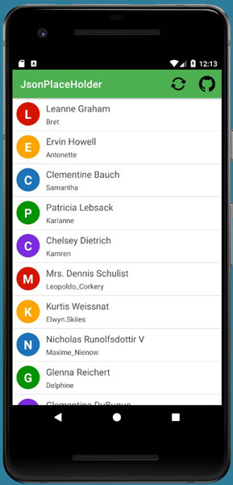
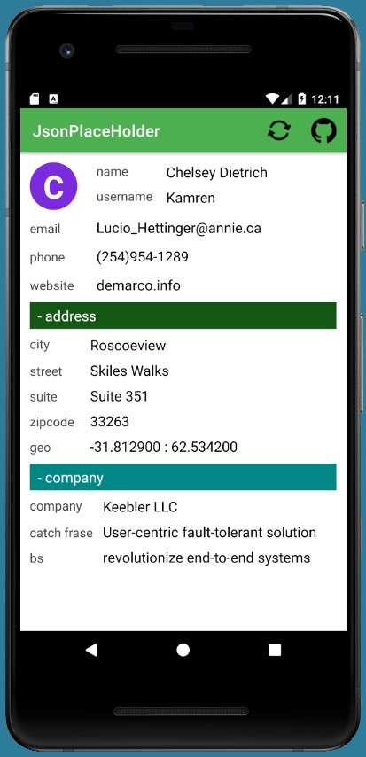
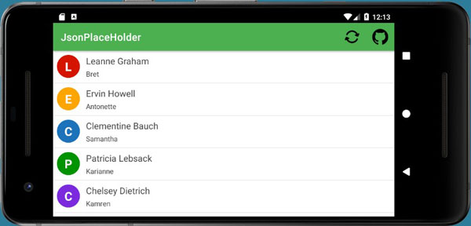
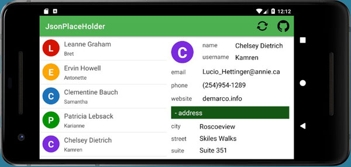

Client for reading users data from 
https://jsonplaceholder.typicode.com/users

----

Lesson theme:
- Retrofit

Features of the program code:
- using pattern NullObject (in classes Company, Address, Geo)
- using pattern State (in MainActivity)

[19.09.21]